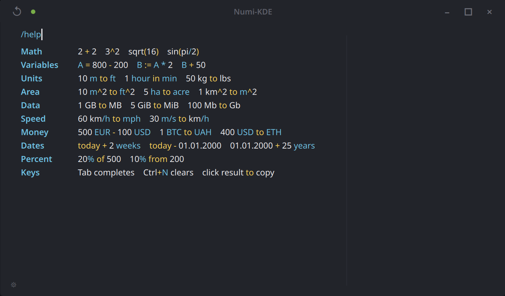

<div align="center">
  
  <h1>Numi-KDE</h1>
  <p><strong>Document-style calculator for KDE Plasma.<br>Type like notes — get live results.</strong></p>

  [](LICENSE)
  [](https://github.com/DMYTROSKORIN/numi-kde/releases/latest)
  [](https://kde.org)
  [](https://qt.io)
  [](https://isocpp.org)
</div>

---



## What is this?

Most calculators force you into buttons, modes, history panels, and copy-paste loops. `numi-kde` treats your calculations as a small live document:

```
Rent      = 1200
Internet  = 45
Coffee    = 4.50 * 18
Total     = Rent + Internet + Coffee

500 AED to USD
today - 01.01.2000
```

You write. It calculates inline. Results appear next to each line as you type.

Inspired by [Numi](https://numi.app) on macOS — built from scratch for KDE on Linux using C++, Qt 6, QML and `libqalculate`.

---

## Install

### Fedora — one command

```sh
curl -fsSL https://raw.githubusercontent.com/DMYTROSKORIN/numi-kde/main/packaging/install.sh | bash
```

The installer downloads the `.rpm` from GitHub Releases, verifies `SHA256SUMS`, installs via `dnf`, and runs a smoke test.

<details>
<summary>More install options</summary>

**Install a specific version:**
```sh
curl -fsSL https://raw.githubusercontent.com/DMYTROSKORIN/numi-kde/main/packaging/install.sh | NUMI_KDE_VERSION=v0.1.6 bash
```

**Dry run (no changes made):**
```sh
curl -fsSL https://raw.githubusercontent.com/DMYTROSKORIN/numi-kde/main/packaging/install.sh | bash -s -- --dry-run
```

**Uninstall:**
```sh
curl -fsSL https://raw.githubusercontent.com/DMYTROSKORIN/numi-kde/main/packaging/uninstall.sh | bash
```
</details>

### Build from Source

For Arch, Ubuntu, Debian and other distributions — build and install from source.

<details>
<summary>Fedora</summary>

```sh
sudo dnf install -y \
  cmake gcc-c++ libqalculate-devel \
  qt6-qtbase-devel qt6-qtdeclarative-devel \
  kf6-kwindowsystem-devel kf6-kglobalaccel-devel
```
</details>

<details>
<summary>Arch Linux</summary>

```sh
sudo pacman -S cmake gcc qt6-base qt6-declarative kwindowsystem kglobalaccel libqalculate
```
</details>

<details>
<summary>Ubuntu 24.04 / Debian Bookworm</summary>

```sh
sudo apt install cmake g++ \
  qt6-base-dev qt6-declarative-dev \
  libkf6windowsystem-dev libkf6globalaccel-dev \
  libqalculate-dev
```

> Ubuntu 22.04 LTS: KF6 packages are not available in standard repositories. Use Ubuntu 24.04+, a PPA, or build KF6 from source.
</details>

**Clone, build and install:**

```sh
git clone https://github.com/DMYTROSKORIN/numi-kde.git
cd numi-kde
cmake -S kde -B build -DCMAKE_BUILD_TYPE=Release
cmake --build build -j$(nproc)
sudo cmake --install build
```

**Build and package as RPM (Fedora):**

```sh
cmake -S kde -B kde/build-release -DCMAKE_BUILD_TYPE=Release
cmake --build kde/build-release --target numi-kde numi-kde-tests -j$(nproc)
ctest --test-dir kde/build-release --output-on-failure
cmake --build kde/build-release --target package
# RPM: kde/build-release/numi-kde-<version>-x86_64.rpm
sudo dnf install -y kde/build-release/numi-kde-*.rpm
```

---

## Features

| | |
|---|---|
| **Document mode** | One expression per line, results aligned in a live column |
| **Math** | Arithmetic, variables, functions — `sqrt`, `sin`, `log` and more |
| **Unit conversion** | Length, weight, speed, area, data, time — natural syntax like `10 m to ft` |
| **Currency** | Live fiat rates via Frankfurter · top crypto via CoinGecko |
| **Date math** | `today + 2 weeks` · `01.01.2000 + 25 years` · spans in years/months/days |
| **Percentages** | `20% of 500` · `10% from 200` |
| **Variables** | `A = 800 - 200` · `B := A * 2` · `B + 50` |
| **Inline help** | Type `/help` — rendered inside the editor with full syntax highlighting |
| **Total footer** | Automatically sums compatible values across all lines |
| **History** | Drawer and session restore across restarts |
| **KDE integration** | Tray icon · global shortcut · launch-at-login · keep-above · Wayland support |

---

## Keyboard

| Shortcut | Action |
|---|---|
| `Ctrl+Alt+1` | Toggle the window globally (configurable in Settings) |
| `Ctrl+N` | Clear the current document |
| `Tab` | Autocomplete units, functions and variables |
| Click a result | Copy it to clipboard |

---

## Command-line Flags

| Flag | Description |
|---|---|
| `numi-kde` | Launch with the main window visible |
| `numi-kde --hidden` | Start silently in the system tray — useful for autostart at login |
| `numi-kde --version` | Print the version string and exit |
| `numi-kde --probe` | Self-test (`2+2`, `1 km to m`) and exit with code `0` on success |
| `numi-kde --help` | Print usage and exit |

---

## Why

I use KDE on Linux daily and missed having a Numi-style calculator — the kind that sits in a small floating window, stays out of the way, and understands expressions written like plain notes. The macOS original is excellent; Linux had nothing close with proper KDE integration.

`numi-kde` is not a port. It is a clean-room implementation in C++ / Qt 6 / QML, backed by `libqalculate`, designed to feel fully native on KDE Plasma.

---

## Project

| | |
|---|---|
| **Language** | C++17 |
| **UI** | Qt 6 · QML |
| **Engine** | libqalculate |
| **Packaging** | `.rpm` for Fedora via GitHub Actions |
| **Docs** | [Architecture](docs/architecture.md) · [Release process](docs/release.md) · [Changelog](CHANGELOG.md) |

---

## Contributing

Fork it, improve it, package it, break it, fix it. All welcome.

Good places to start:
- Calculator compatibility and edge cases
- KDE Wayland and X11 testing
- Fedora, Ubuntu and Debian packaging
- UI polish and accessibility
- Documentation and examples

---

## Acknowledgements

`numi-kde` exists because of excellent prior work:

- **[Numi](https://numi.app)** by Nikolaeu — the document-calculator idea and the UX that made me want this on Linux. The core concept is directly inspired by his work (used under the MIT License).
- **[libqalculate](https://qalculate.github.io)** — the powerful calculation engine that handles the hard parts.
- **[KDE](https://kde.org) and KWin** — the desktop platform, integration APIs, and the community that makes Linux worth using.
- **[Qt / QML](https://qt.io)** — the native UI framework.
- **[Frankfurter](https://www.frankfurter.app)** — open fiat exchange rate API.
- **[CoinGecko](https://www.coingecko.com)** — public crypto market data.
- The broader open-source Linux desktop community — for the libraries and tooling that make independent projects like this possible.

---

## License

[](LICENSE)

Released under the [Apache License 2.0](LICENSE).  
See [NOTICE](NOTICE) for third-party attribution.

---

<sub>Contact: <a href="mailto:dev@skorin.online">dev@skorin.online</a></sub>
