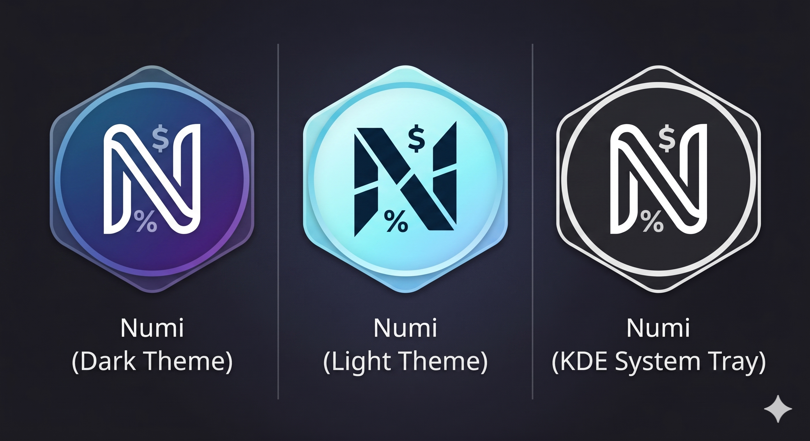

# numi-kde



`numi-kde` is a KDE-native document calculator inspired by Numi: you type a small text document on the left, and results appear line-by-line on the right.

The goal is a fast, quiet calculator for Linux/KDE that feels native: compact window, keyboard-first workflow, tray integration, global shortcut, KDE window behavior, history, settings, and a calculation engine strong enough for math, units, currencies, crypto and dates.

This project is not affiliated with Numi. It is an independent native KDE implementation built with respect for the ideas and open technologies that made this kind of tool possible.

## Status

- Runtime: C++ / Qt 6 / QML.
- Calculation engine: `libqalculate`.
- Desktop integration: KDE tray icon, global shortcut, clipboard, saved geometry, launch-at-login and KWin keep-above integration.
- Current verification: native CMake build and native CTest pass.
- Packaging: manual build is available now; one-line GitHub Releases installer is planned in `docs/installation-plan.md`.

## What It Does

- Math: `2 + 2 * 3^2`, `sqrt(256)`, `sin(pi/2)`.
- Variables: `A = 800 - 200`, `B := A * 2`, `B + 50`.
- Units: `10 meters in feet`, `50 kg to lbs`, `1 km to m`.
- Currency and crypto: fiat units supported by `libqalculate`, plus live CoinGecko-backed top-crypto conversion such as `400 USD to ETH`.
- Consistent conversion results: `500 AED to USD` returns `USD <value>`, `1 BTC to EUR` returns `EUR <value>`.
- Dates/time: `today + 2 weeks`, `today - 01.01.2000`, `01.01.2000 - 02.05.2026`, `01.01.2000 + 25 years`, `time`, `now`.
- Percentages: `20% of 300`, `20% from 300`; incomplete input like `20% from` stays quiet until finished.
- Inline `/help`: readable examples rendered inside the editor using the same syntax highlighter as normal input.
- Total footer: sums only compatible numeric result rows; mixed units or currencies do not show a misleading total.
- Result column: auto-expands for long results and keeps the separator from covering visible text.
- History drawer: saves and restores recent sessions.
- Settings: always on top, launch at login, result separator, font size, result column width, decimal places and global hotkey.
- Keyboard: `Ctrl+Alt+1` toggles the app globally by default, `Ctrl+N` clears the document, `Tab` completes units/functions/variables.

## KDE Behavior

On KDE Wayland, applications cannot directly force themselves above other windows. `numi-kde` handles "Always on top" by writing a managed KWin window rule and asking KWin to reconfigure. On X11 it also uses `NET::KeepAbove`.

The app and tray icons are transparent PNG resources in `kde/resources/` and are embedded into the Qt resource binary during build.

## Install

The polished one-line installer is planned but not published yet.

Target command after release packaging is ready:

```sh
curl -fsSL https://github.com/DMYTROSKORIN/numi-kde/releases/latest/download/install.sh | bash
```

The installer plan is documented in `docs/installation-plan.md`. The intended production path is GitHub Releases with verified `.deb` and `.rpm` packages, not compiling source on the user's machine.

## Build From Source

### Fedora Dependencies

```sh
sudo dnf install -y \
  cmake gcc-c++ libqalculate-devel \
  qt6-qtbase-devel qt6-qtdeclarative-devel \
  kf6-kwindowsystem-devel kf6-kglobalaccel-devel
```

Package names vary by distribution. The CMake target requires Qt 6 Core/DBus/Gui/Widgets/Network/Qml/Quick/QuickControls2, KF6WindowSystem, optional KF6GlobalAccel, and `libqalculate`.

### Commands

```sh
cmake -S kde -B build/kde
cmake --build build/kde --target numi-kde numi-kde-tests
ctest --test-dir build/kde --output-on-failure
./build/kde/numi-kde --version
./build/kde/numi-kde --probe
./build/kde/numi-kde
```

## Documentation

- `docs/kde-native.md`: native KDE build/runtime notes.
- `docs/implementation-plan.md`: roadmap and current phase status.
- `docs/installation-plan.md`: one-line installer design for KDE Linux distributions.
- `docs/architecture.md`: current layer boundaries.
- `CHANGELOG.md`: release notes.

## Thanks

`numi-kde` stands on the work of other projects:

- Numi, for the document-calculator idea and user experience inspiration.
- Qalculate/libqalculate, for the calculation engine that powers math, units and conversions.
- KDE and KWin, for the desktop platform, window behavior and integration points.
- Qt and QML, for the native UI and application framework.
- CoinGecko, for public crypto market data used by the crypto conversion path.
- The broader open-source Linux desktop community, whose libraries, packaging tools and documentation make projects like this realistic.

Thank you to everyone building and maintaining these projects. This repository exists because that work exists.

## Contributing

The project is intended to be easy to study, fork, improve and adapt. Useful contributions include:

- calculator compatibility fixes;
- KDE integration testing on Wayland and X11;
- packaging for Fedora, Ubuntu and Debian;
- installer validation on clean KDE systems;
- UI polish and accessibility improvements;
- documentation and examples.

Before public release, the repository should get an explicit open-source `LICENSE` file and matching AppStream metadata. MIT is the recommended license if the goal is to allow broad reuse with minimal restrictions.
